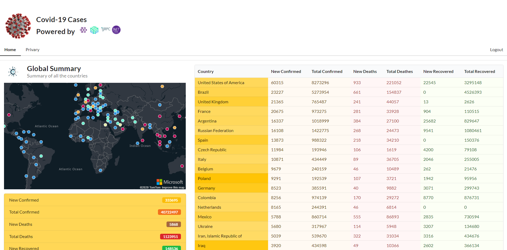

# LinkerD Demo application on AKS

This repository contains a simple application written in .net core that runs on Linux container on Azure Kubernetes Service and uses LinkerD service mesh to demonstrate the service mesh proxies that intercept gRPC inter-service calls, deploying mTLS, observability etc.

# What the application does?

There are 3 services in this app.
- Web interface
- Backend service
- Daemon service

## Daemon service
Continuously collects COVID-19 updates from public APIs and relay them to the Backend service. Also raises Azure SignalR notifications for Live cases.

## Backend service
Receives information from Daemon service and caches them in memory collections.

## Web service
Only talks to the backend service and fetches data every 5 seconds and displays them into the UI. Also received live updates from Azure SignalR and shows them in a Azure map.

# How to run?
The Azure pipeline (azure-pipeline.yml) has all the necessary commands that will create a AKS cluster, install LinkerD on it and then build the docker images for 3 services, push them in Docker public registry and then deploy them to AKS.

To run locally, you can execute the bash files, specially buildimages.sh and deploy-to-aks.sh.
